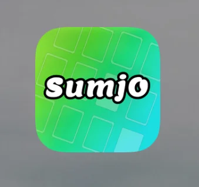
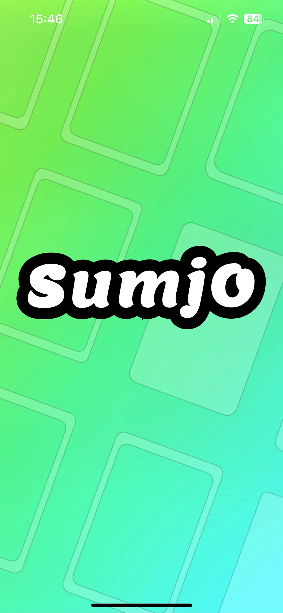

<p align="center">
  
  <p align="center" style="font-weight: 800;">
    v1.0.3
  </p>
</p>

**Sumjo** is an image recognition application that uses AI to calculate the outcome of a SKYJO (c) game by analyzing a photo taken at the end of the game.

SKYJO, a card game developed by Magilano and suitable for players aged 7 to 99, is an engaging and entertaining experience. The goal is to maintain the lowest score possible across multiple rounds. Scores are carefully tracked and summed up after each round, with the game ending when any player exceeds 100 points. The player with the lowest total score at this point is declared the winner.

- [💻 Install](#install)
- [📸 Screenshots](#screenshots)
- [🎥 Demo](#demo)
- [❔️ How it Works](#how-it-works)
- [⬇️ Use from sources](#use-from-sources)
- [📜 License](#license)

## Install

~~The application can be installed via the Google Play Store or Mac App Store on mobile device.~~ --> **Soon**

Please note that it is currently in beta testing phase and not publicly available. To request an invitation to try out Sumjo, send me a message. I will add you to the preview list, allowing you to find Sumjo in Google Play store.

Alternatively you can build the app yourself, see [⬇️ Use from sources](#use-from-sources) or [releases page](https://github.com/tib0/sumjo/releases) install APK according to the following [how to](https://www.wikihow.com/Install-APK-Files-on-Android).

## Screenshots

<p align="center">
  
</p>

<p align="center">
  
</p>

<p align="center">
  
</p>

## Demo

<div align="center">
  <a href="https://www.youtube.com/watch?v=WRWxTETLeCU">
    
  </a>
</div>

## How it works

### App usage

At the end of a Skyjo game run the app and take a picture of your board state by touching the button, then the result will appear on the screen.

### Internally

I used models and training data samples available here https://universe.roboflow.com/elmurd0r/skyjo to train a TFLite model with Yolo https://github.com/ultralytics/yolov5. I used Expo (https://expo.dev/) to power the app with code written in React Native. The model itself runs with https://github.com/mrousavy/react-native-fast-tflite which relies on TensorFlow Lite library and exposes it to my react components. To handle camera, I use https://github.com/mrousavy/react-native-vision-camera. The picture is then cropped and resized using Skia https://github.com/shopify/react-native-skia.

### Device compatibility

- Needs camera
- iOS / Android

| Ref                 | Version       | Year |
| ------------------- | ------------- | ---- |
| Expo SDK            | 51            | 2024 |
| Android (OS)        | 13 (Tiramisu) | 2022 |
| Android (API level) | 33            | 2022 |
| iOS (OS)            | 13            | 2019 |

## Use from sources

Clone this project, install dependencies and then from the project folder run command below.

### Setup your Expo env:

https://docs.expo.dev/get-started/set-up-your-environment/

### For Android:

https://docs.expo.dev/workflow/android-studio-emulator/

```
npx expo run:android
```

### For iOS:

https://docs.expo.dev/workflow/ios-simulator/

```
npx expo run:ios
```

## License

CC-BY-NC-ND :

> ##
>
> #### You are free to:
>
> - **Share** — copy and redistribute the material in any medium or format. The licensor cannot
>   revoke these freedoms as long as you follow the license terms.
>
> #### Under the following terms:
>
> - **Attribution** — You must give appropriate credit, provide a link to the license, and
>   indicate if changes were made . You may do so in any reasonable manner, but not in any way
>   that suggests the licensor endorses you or your use.
> - **Non Commercial** — You may not use the material for commercial purposes .
> - **No Derivatives** — If you remix, transform, or build upon the material, you may not
>   distribute the modified material.
> - **No additional restrictions** — You may not apply legal terms or technological measures
>   that legally restrict others from doing anything the license permits.
>
> #### Notices:
>
> You do not have to comply with the license for elements of the material in the public domain
> or where your use is permitted by an applicable exception or limitation.
>
> #### No warranties are given:
>
> The license may not give you all of the permissions necessary for your intended use. For
> example, other rights such as publicity, privacy, or moral rights may limit how you use the
> material.
>
> ##
>
> _Find out more [here](./LICENCE.md)_
